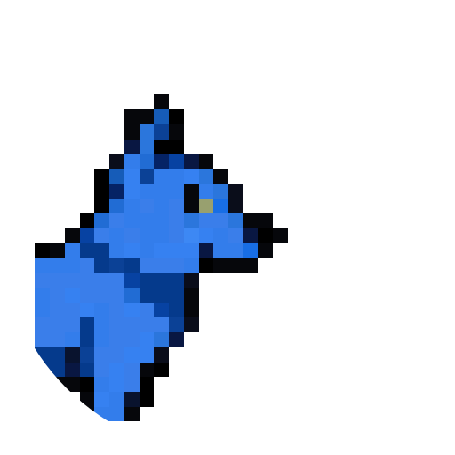

<div align="center">
  
  <h1>FangDash</h1>
  <p><em>Run with the pack. Dash to the top.</em></p>
  <p>Multiplayer endless runner for Twitch streamers and their communities.</p>
</div>

FangDash is a fast-paced multiplayer endless runner where
players race as wolves, dodging obstacles and competing for
the highest score. Built for Twitch streamers and their
communities, it features real-time racing, unlockable skins,
achievements, and leaderboards.

## Features

- **Endless Runner Gameplay** — Jump, dodge, and dash through
  procedurally generated obstacle courses as a wolf.
- **Multiplayer Racing** — Race up to 4 players in real-time
  using WebSocket-powered rooms.
- **Twitch Integration** — Sign in with Twitch, race your
  chat, and show off your skins on stream.
- **10 Unlockable Wolf Skins** — Earn skins from Gray Wolf to
  Phantom Wolf through achievements and milestones.
- **16 Achievements** — Track your progress across score,
  distance, games played, skill, and social categories.
- **Leaderboards** — Compete globally with anti-cheat
  validated score submissions.
- **Difficulty Scaling** — Speed ramps from 300 to 800 px/s
  with narrowing obstacle gaps as you run further.
- **Deterministic Multiplayer** — Seeded PRNG ensures all
  racers face the same obstacle layout.

## Getting Started

1. Clone the repository:

```bash
git clone https://github.com/MrDemonWolf/fangdash.git
cd fangdash
```

2. Install dependencies:

```bash
pnpm install
```

3. Set up environment variables:

```bash
cp apps/api/.dev.vars.example apps/api/.dev.vars
cp apps/web/.env.local.example apps/web/.env.local
```

4. Start all services in development:

```bash
pnpm dev
```

The web app runs at `http://localhost:3000` and the API at
`http://localhost:8787`. The docs site runs at `http://localhost:3001`.

## Tech Stack

| Layer          | Technology                          |
| -------------- | ----------------------------------- |
| Frontend       | Next.js 15, React 19, Tailwind v4   |
| Game Engine    | Phaser 3                            |
| API            | Hono on Cloudflare Workers          |
| Database       | Cloudflare D1 (SQLite) + Drizzle ORM|
| Auth           | Better Auth with Twitch OAuth       |
| API Layer      | tRPC v11                            |
| Multiplayer    | PartyKit (WebSockets)               |
| Monorepo       | Turborepo + pnpm workspaces         |
| Docs           | Fumadocs + Next.js                  |
| Testing        | Vitest                              |
| CI/CD          | GitHub Actions + Cloudflare Workers  |
| Language       | TypeScript 5.7 (strict mode)        |

## Development

### Prerequisites

- Node.js >= 20
- pnpm 10.x (`corepack enable`)
- Cloudflare account (for D1 database and Workers deploys)
- Twitch Developer application (for OAuth)

### Setup

1. Install dependencies:

```bash
pnpm install
```

2. Create a Cloudflare D1 database:

```bash
cd apps/api
npx wrangler d1 create fangdash-db
```

3. Update `apps/api/wrangler.toml` with your D1 database ID.

4. Run database migrations:

```bash
cd apps/api
npx wrangler d1 migrations apply fangdash-db --local
```

5. Configure `apps/api/.dev.vars` with your secrets:

```
BETTER_AUTH_SECRET=<your-secret>
BETTER_AUTH_URL=http://localhost:8787
TWITCH_CLIENT_ID=<your-twitch-client-id>
TWITCH_CLIENT_SECRET=<your-twitch-client-secret>
```

6. Configure `apps/web/.env.local`:

```
NEXT_PUBLIC_API_URL=http://localhost:8787
```

7. Start development:

```bash
pnpm dev
```

### Development Scripts

- `pnpm dev` — Start all apps in development mode.
- `pnpm build` — Build all packages and apps.
- `pnpm test` — Run all tests with Vitest.
- `pnpm test:coverage` — Run tests with coverage report.
- `pnpm type-check` — Type-check all packages.
- `pnpm lint` — Lint all packages.
- `pnpm clean` — Remove all build artifacts.
- `pnpm ship` — Deploy API, web, and PartyKit to production.
- `pnpm ship:api` — Deploy API to Cloudflare Workers.
- `pnpm ship:web` — Deploy web app to Cloudflare Workers.
- `pnpm ship:party` — Deploy PartyKit server.
- `pnpm --filter @fangdash/web generate:icons` — Regenerate favicon and PWA icons from the wolf sprite (web + docs).

### Code Quality

- Strict TypeScript with `strict: true` across all packages.
- Vitest for unit and integration testing.
- GitHub Actions CI runs type-check and tests on every PR.
- tRPC for end-to-end type safety between API and frontend.

## Project Structure

```
fangdash/
├── apps/
│   ├── api/           # Hono API on Cloudflare Workers
│   ├── docs/          # Fumadocs documentation site
│   ├── party/         # PartyKit WebSocket server
│   └── web/           # Next.js frontend
├── packages/
│   ├── game/          # Phaser 3 game engine
│   └── shared/        # Types, constants, skins, achievements
├── .github/
│   └── workflows/     # CI and deploy pipelines
├── turbo.json         # Turborepo task config
├── tsconfig.base.json # Shared TypeScript config
└── pnpm-workspace.yaml
```

## License


## Contact

Have questions or feedback?

- Discord: [Join my server](https://mrdwolf.net/discord)

---

Made with love by [MrDemonWolf, Inc.](https://www.mrdemonwolf.com)
